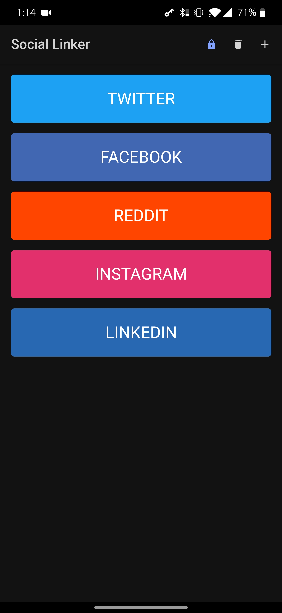
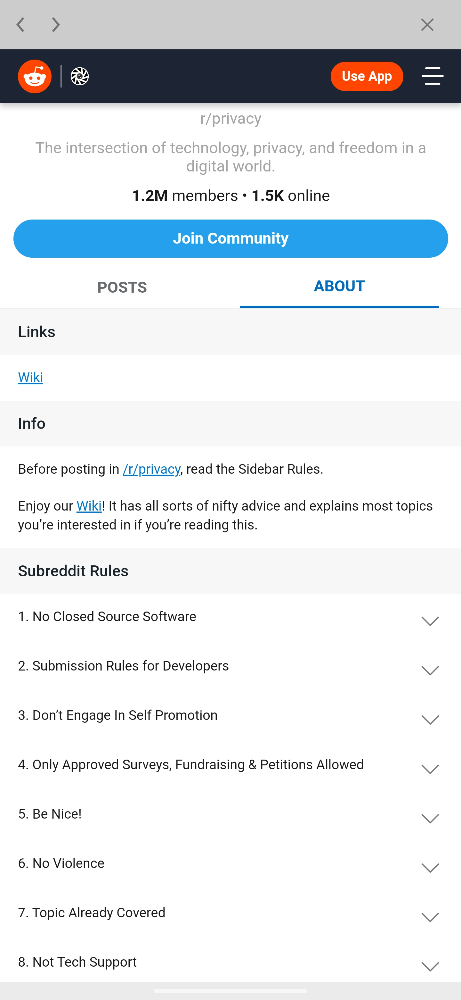
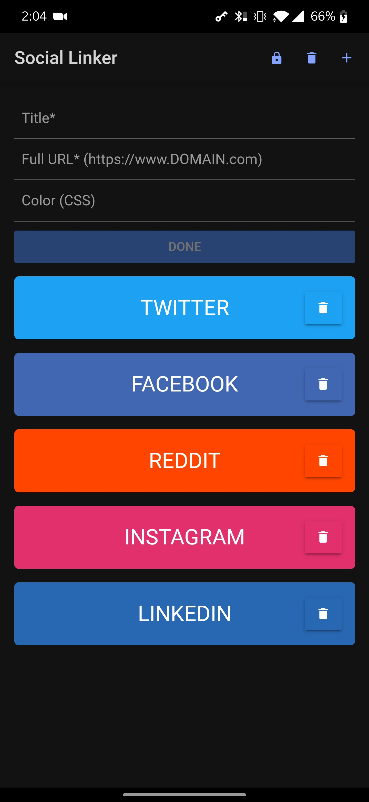

# social-linker
social-linker is about as simple as it gets: Nice looking shortcuts to social media websites. This app is for people that don't like or use social media apps, but want to easily check in every now and then. Works best if paired with a browser that blocks cross-site cookies and trackers, like Brave. The app is small and lightweight, and takes advantage of Ionic/Cordova. Find the latest signed build <a href="https://github.com/pslyman/social-linker/tree/main/resources/builds">here</a>.

## features
- Lock button: can run sites within the app's Webview. HTTPS is enforced for external links. Cookies, cache, session data, etc, will be entirely contained within the app. 
- Add button: add sites with Title, URL, and Color (optional. Any CSS color type is acceptable. Default: darkgrey).
- Edit button: edit or delete any sites.

## run locally

- npm install -g @ionic/cli

- npm install
 
- ionic serve

If you find this app doesn't have the features you need, consider checking out something a little more robust, check out <a href="https://play.google.com/store/apps/details?id=com.tobykurien.webapps">WebApps</a> (not made by me)
